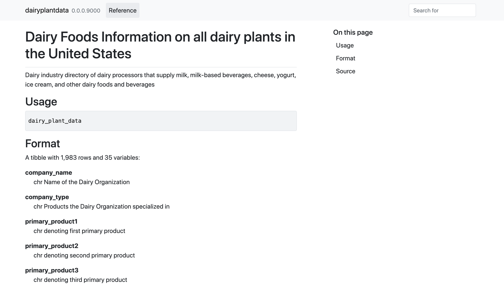

```{r setup, include=FALSE}
knitr::opts_chunk$set(echo = TRUE)
```

# About the Project

The purpose behind building `{dairyplantdata}` data package was to facilitate senior economists at the University of Nebraska - Lincoln to investigate the [Economic Impact of Dairy Processing Expansion in Nebraska](https://farm.unl.edu/documents/dairy/economic-impact-dairy-processing-expansion-may-3-2021.pdf). It was also built to remove the hassle of searching datasets in some corner of our computer. 

I personally did not want to go through multiple folders searching for a dataset, so I was more motivated to build this into a data package. 

- Learn More: [Economic Impact of Dairy Processing Expansion in Nebraska](https://farm.unl.edu/documents/dairy/economic-impact-dairy-processing-expansion-may-3-2021.pdf)

- You can access the usage information here: [dairyplantdata](https://nbhabish.github.io/dairyplantdata/reference/dairy_plant_data.html)



# How to use?

- Run the following piece of code:

```{r eval=FALSE}
# install.package("remotes")   #In case you have not installed it.
remotes::install_github("nBhabish/dairyplantdata")

dairyplantdata::dairy_plant_data
```

