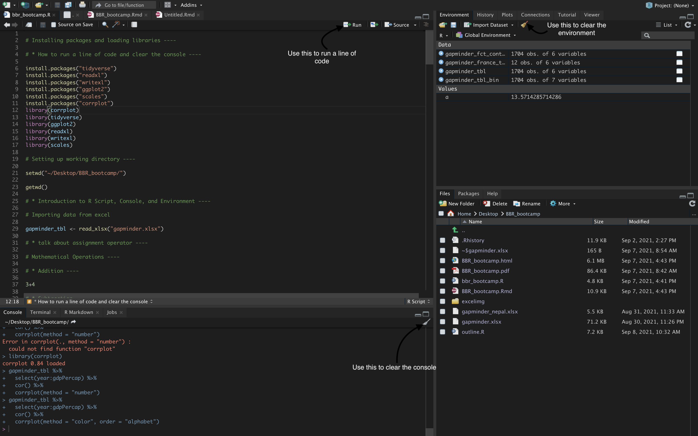
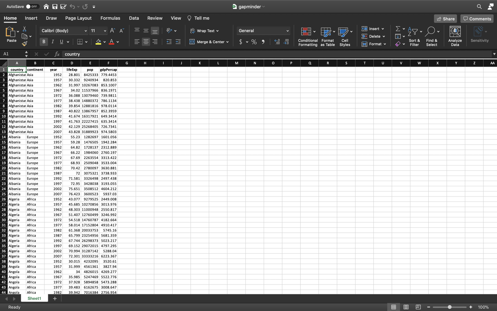

```{r setup, include=FALSE}
knitr::opts_chunk$set(echo = TRUE,
                      message = FALSE,
                      warning = FALSE,
                      out.width = "100%",
                      out.height = "100%",
                      fig.align = "center", # will center all of the plots
                      dpi = 300)
```

# Today's Goals 

- Introduce you to some regular R commands.
- Read in a dataset.
  - Here we will import the data from excel. 
- Manipulate the dataset.
  - Here we will create a new dataset with observations coming from __France__ only.
  - We will also take a look at the population of different continents in the year 1952. 
  - We shall work on some examples as well.
- Create a simple visualization using the same dataset.
  - Here we will create a simple bar chart that shows the population of different continents in the year 1952.
- Run a simple statistical analysis- correlation plot.

## Running a line of code, clearing console, and clearing environment



- If you follow the arrows in the above picture, you'll learn the following:
  - Learn how to run a line of code
  - Learn how to clear the console and the environment

# Introduction to `install.packages()` and `library()`

```{r libraries, echo=TRUE}
# install.packages("tidyverse")
# install.packages("readxl")
# install.packages("writexl")
# install.packages("ggplot2")
# install.packages("gapminder")
# install.packages("scales")
library(tidyverse)
library(ggplot2)
library(readxl)
library(writexl)
library(gapminder)
library(scales)
```

- `install.packages()` and `library()` go hand-in-hand for the first time. If you have installed a certain package previously, then you don't need to reinstall the package every time you open a new R session. When you open a new R session, just run the `library(package_name)` to load that certain package. 


# Introduction to `set.wd()` and `get.wd()`

- `set.wd()` allows us to set a working directory.
- `get.wd()` allows us to see what working directory we are in right now.

# Introduction to R script, console, and environment.

- An R script is simply a text file containing (almost) the same commands that you would enter on the command line of R. (__top left box__)

- The console window (in RStudio, the bottom left panel) is the place where R is waiting for you to tell it what to do, and where it will show the results of a command. (__bottom left box__)

- Lastly, environment is a collection of all the objects, variables, and functions. (__top right box__)

# Data on Excel



-  Here we are trying to import the data from excel sheet. Once we import, we will see the same data in our R session. 

# Importing the Gapminder excel file

```{r data}
gapminder_tbl <- read_xlsx("gapminder.xlsx")
```

- The assignment operator is used to assign a value. 

```{r ,fig.cap="Gapminder dataset"}
gapminder_tbl
```


# Some Mathematical Operations

## Addition
```{r}
3+4
```

## Subtraction

```{r}
5-3
```

## Multiplication

```{r}
3*5
```

## Division


```{r}
3/4
```


## Raised to the power

```{r}
3^4
```
## Assigning value to a variable "a"

```{r}
a <- 3+4

a
```

## Overwriting a variable

```{r}
a <- 95/7

a 
```

# Data Types

- Some common data types that we will learn today are:

  - __Numeric:__ Anything that is numerical.
  - __Character:__ Anything inside quotation marks. 
  - __Factors:__ Conceptually, factors are variables in R which take on a limited number of different values, and such values are called categorical variables.
  - __Logical__: TRUE/ FALSE
  

```{r}
# numeric
class(7)

class(7.2)

# character
class("abcd")

# factor
class(as.factor("High"))

# logical

class(TRUE)
```

# Manipulating Dataset 

## What is a pipe operator? 

- Pipe operator is denoted by symbol `%>%`. Shortcut for the pipe operator is `Shift + CMD/ CTRL + M`
- Pipe operator allows us to pass the output of a function as a input to the other one in sequence. 


## `view()`

- `view()` allows us to take a look at the whole dataset. 

```{r}
gapminder_tbl %>% 
  view()
```

## `glimpse()`
```{r}
gapminder %>% 
  glimpse()
```


- `glimpse()` allows us to take a quick glance at the structure of our dataset. It allows us to see what type of variables are present in our dataset.


## `head()`

```{r}
gapminder_tbl %>%
  head()
```
- `head()` returns the first six observations from our dataset.

## `tail()`

```{r}
gapminder_tbl %>% 
  tail()
```
- `tail()` returns the last six observations from our dataset. 

## `select()` and why we use `select()`?

- Imagine we are working on a hypothetical dataset with 150 columns. Out of those 150 columns we only need 5 columns at max. This is when `select()` comes in handy.

- In our dataset, let's say we only want country, continent, year, and population as our columns. 

```{r}
gapminder_tbl %>% 
  select(country, continent, year, pop)
```

### Using `everything()` to select the rest of the columns
- Now, let's say we want the continent column at the very beginning followed by remaining columns.
- In the code chunk below, `everything()` allows us to select rest of the columns instead of manually typing them out. 

```{r}
gapminder_tbl %>% 
  select(continent, everything())
```

## `filter()`

- `filter()` allows us to filter the observations by rows. 
- One of our main goals today is to create a dataset with observations coming from __France__ only.
- Here's how we do it:
- I know, you are seeing a double equals to `==`. This `==` is an equality operator. This allows you to see whether two objects are equal or not.
- However, when using `filter()`, double equals (`==`) means __equal to__ and `!=` means __not equal to__. 
- Using a single equals sign will often give an error message that is not intuitive, so make sure you check for this common error. 

```{r}
gapminder_france_tbl <- gapminder_tbl %>% 
  filter(country == "France")

gapminder_france_tbl
```

### Let's work on some examples:

- Let's say we only want observations from __Asia__
- Let's say we only want observations from the year __1952__
- Let's say we don't want observations from Europe


```{r}
# gapminder_tbl %>% 
#   filter(continent == "Asia")
# 
# gapminder %>% 
#   filter(year == 1952)
# 
# gapminder %>% 
#   filter(continent != "Europe")
```
## `count()`

- `count()` allows us to quickly count unique values of one or more variables.
- Let's say we want to know how many times a particular continent appeared in our dataset.
- `sort = TRUE` arranges the column in descending order.

```{r}
gapminder_tbl %>% 
    count(continent, sort = TRUE) 
```

## `mutate()`
- `mutate()` allows us to create new columns or modify the existing columns. 
- Let's say we want to increase the population of every country by 10 times. 
- The code chunk below demonstrates an example of creating new column using `mutate()`.

```{r}
gapminder_tbl %>% 
  mutate(pop_increased_10_times = pop * 10)

# gapminder %>% 
#   mutate(pop_increased_by_10 = pop + 10)
```


## Converting a character variable into categorical variable and vice versa

```{r}
gapminder_tbl %>% 
  mutate(continent = as.factor(continent)) %>% 
  glimpse()
```

```{r}
gapminder_tbl %>% 
  mutate(continent = as.factor(continent)) %>% 
  mutate(continent = as.character(continent)) %>% 
  glimpse()
```

## `arrange()`

- `arrange()` allows us to arrange columns in ascending (`aesc(variable_name)`) or descending (`desc(variable_name)`) order.
- Default is ascending order. 

```{r}
gapminder_afg_asc <- gapminder_tbl %>% 
    filter(country == "Afghanistan") %>% 
    arrange(pop)

gapminder_afg_asc
```


```{r}
gapminder_afg_desc <- gapminder %>% 
    filter(country == "Afghanistan") %>%
    arrange(desc(pop))

gapminder_afg_desc
```

## Creating bins using `ntile()`

- `ntile()` takes in your entire column and decides what cut-points to use and bins it accordingly into however many bins you want.


```{r}
gapminder_tbl %>% 
    mutate(gdpPercap_bin = ntile(gdpPercap, 3))
```

## `ntile()` and `case_when()`

```{r}
gapminder_tbl %>% 
  mutate(
    gdpPercap_bin2 = case_when(
      gdpPercap > quantile(gdpPercap, 0.66) ~ "High",
      gdpPercap > quantile(gdpPercap, 0.33) ~ "Medium",
      TRUE ~ "Low"
    )
  ) 

```


## `group_by()` and `summarise()`

- `group_by()` and `summarise()` always go hand-in-hand. 
- `group_by()` takes an existing table and converts it into a grouped table where operations are performed. And, these operations are performed using `summarise()`
- Once you use, `group_by()` and `summarise()`, make sure to `ungroup()`. 
- Let's say we want to know the population of each continent in year 1952.

```{r}
gapminder_tbl %>% 
  filter(year == 1952) %>% 
  group_by(continent) %>% 
  summarise(population = sum(pop)) %>% 
  ungroup() %>% 
  arrange(desc(population))
  
```


# Visualization {.tabset .tabset-fade .tabset-pills}

- We have gone over most of the functions above that we are going to use in this section.
- One new function that is very important in this section is `ggplot()` which comes from ggplot2 library.
- `ggplot()` allows us to create plots using the data. 

## Non-sorted visualization


```{r vis-2}
gapminder_tbl %>% 
    filter(year == 1952) %>% 
    group_by(continent) %>% 
    summarise(total_population = sum(pop)) %>% 
    ungroup() %>% 
    # arrange(desc(total_population)) %>% 
    mutate(continent = as.factor(continent)) %>% 
    # Visualize
    
    ggplot(aes(continent, total_population))+
    geom_col(fill = "#2c3e50", width = 0.5)+
    
    scale_y_continuous(labels = scales::comma)+
    theme_minimal()+
    
    labs(title = "Population of Different Continents in 1952",
         x = "",
         y = "Population",
         subtitle = "",
         caption = "Data Source: Gapminder")
```


## Sorted Visualization

```{r vis-1}
gapminder_tbl %>% 
   filter(year == 1952) %>% 
    group_by(continent) %>% 
    summarise(total_population = sum(pop)) %>% 
    ungroup() %>% 
    arrange(desc(total_population)) %>% 
    mutate(continent = as_factor(continent)) %>%
    # Visualize

    ggplot(aes(continent, total_population))+
    geom_col(fill = "#2c3e50", width = 0.5)+

    scale_y_continuous(labels = scales::comma)+
    theme_minimal()+

    labs(title = "Population of Different Continents in 1952",
         x = "",
         y = "Population",
         subtitle = "",
         caption = "Data Source: Gapminder")
```


# Saving `gapminder_france_tbl` as an excel file

- `write_xlsx()` allows us save our table as an excel file.
- How to: `write_xlsx(name_of_the_table_in_R, path = "wherever_you_want_to_save/give_a_name.xlsx")`

```{r}
# writexl::write_xlsx(gapminder_france_tbl, path = "gapminder_france.xlsx")
```


# Correlation Plot {.tabset .tabset-fade .tabset-pills}

## Plot 1

```{r, out.height= "50%", out.width= "50%"}
# install.packages("corrplot")
library(corrplot)

gapminder_tbl %>% 
    select(year:gdpPercap) %>% 
    cor() %>% 
    corrplot(method = "number")
    
```

## Plot 2

```{r, out.height= "50%", out.width= "50%"}

gapminder_tbl %>%
    select(year:gdpPercap) %>%
    cor() %>%
    corrplot(method = "color", order = "alphabet")
```


