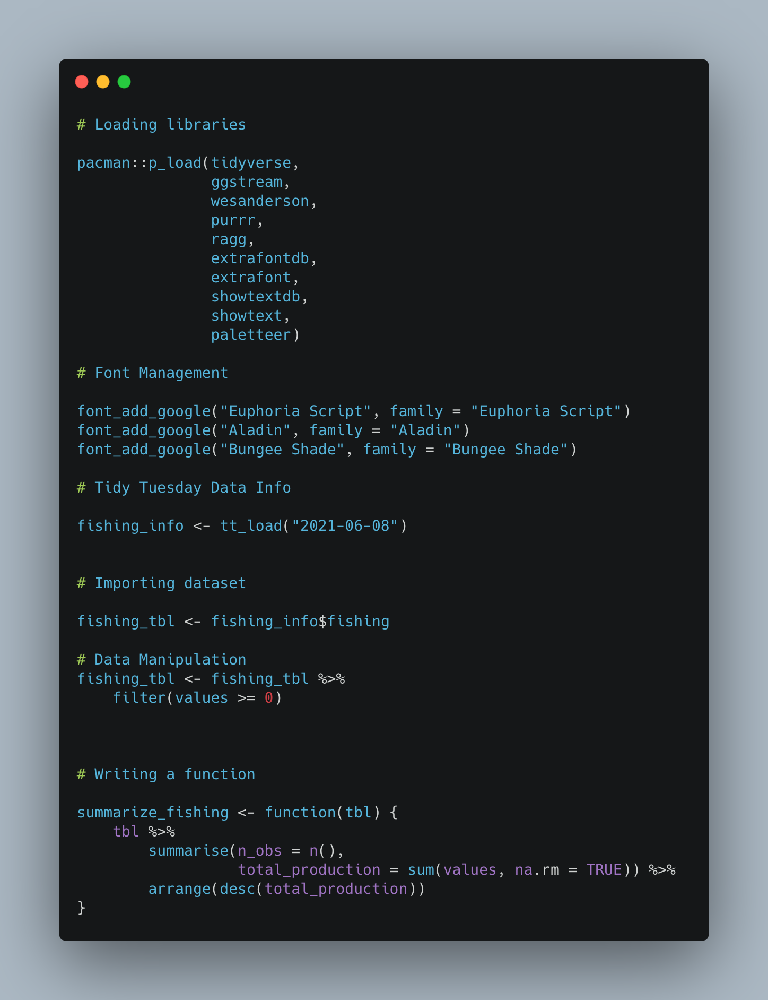
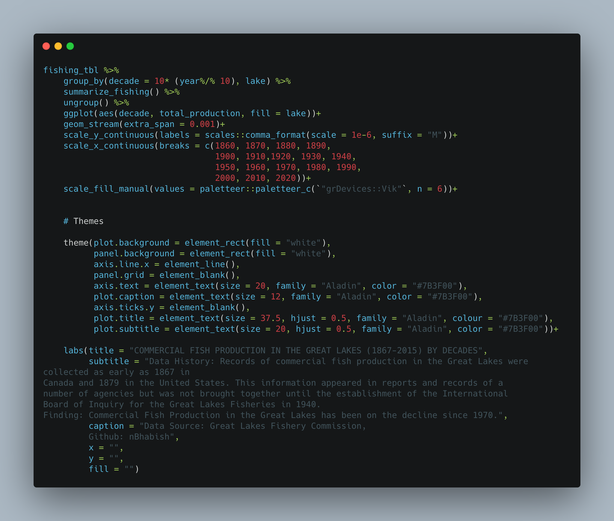

```{r img, message=FALSE, warning=FALSE, include=FALSE}
knitr::opts_chunk$set(fig.retina = 2)
```

```{r loading-libraries, message=FALSE, warning=FALSE, include=FALSE}
library(rvest)
library(tidyverse)
library(purrr)
library(ragg)
library(extrafontdb)
library(extrafont)
library(showtextdb)
library(showtext)
library(tidytuesdayR)
```


```{r importing data, message=FALSE, warning=FALSE, include=FALSE}
tt <- tidytuesdayR::tt_load("2021-06-08")

fishing_tbl <- tt$fishing
```

```{r data-prep, message=FALSE, warning=FALSE, include=FALSE}
# Loading libraries

pacman::p_load(tidyverse,
               ggstream,
               wesanderson,
               purrr,
               ragg,
               extrafontdb,
               extrafont,
               showtextdb,
               showtext, 
               paletteer)

# Font Management


font_add_google("Euphoria Script", family = "Euphoria Script")
font_add_google("Aladin", family = "Aladin")
font_add_google("Bungee Shade", family = "Bungee Shade")
showtext_auto()

# Tidy Tuesday Data Info

fishing_info <- tt_load("2021-06-08")


# Importing dataset

fishing_tbl <- fishing_info$fishing

# Data Manipulation 
fishing_tbl <- fishing_tbl %>% 
    filter(values >= 0)


# Writing a function

summarize_fishing <- function(tbl) {
    tbl %>% 
        summarise(n_obs = n(),
                  total_production = sum(values, na.rm = TRUE)) %>% 
        arrange(desc(total_production))
}

```


# Visualization

```{r plotting, echo=FALSE, fig.height=9, fig.width=18, message=FALSE, warning=FALSE}
# Visualizing by decade
fishing_tbl %>% 
    group_by(decade = 10* (year%/% 10), lake) %>% 
    summarize_fishing() %>% 
    ungroup() %>% 
    ggplot(aes(decade, total_production, fill = lake))+
    geom_stream(extra_span = 0.001)+
    scale_y_continuous(labels = scales::comma_format(scale = 1e-6, suffix = "M"))+
    scale_x_continuous(breaks = c(1860, 1870, 1880, 1890,
                                  1900, 1910,1920, 1930, 1940,
                                  1950, 1960, 1970, 1980, 1990,
                                  2000, 2010, 2020))+
    scale_fill_manual(values = paletteer::paletteer_c(`"grDevices::Vik"`, n = 6))+
    
    
    # Themes
    
    theme(plot.background = element_rect(fill = "white"),
          panel.background = element_rect(fill = "white"),
          axis.line.x = element_line(),
          panel.grid = element_blank(),
          axis.text = element_text(size = 20, family = "Aladin", color = "#7B3F00"),
          plot.caption = element_text(size = 12, family = "Aladin", color = "#7B3F00"),
          axis.ticks.y = element_blank(),
          plot.title = element_text(size = 37.5, hjust = 0.5, family = "Aladin", colour = "#7B3F00"),
          plot.subtitle = element_text(size = 20, hjust = 0.5, family = "Aladin", color = "#7B3F00"))+
    
    labs(title = "COMMERCIAL FISH PRODUCTION IN THE GREAT LAKES (1867-2015) BY DECADES",
         subtitle = "Data History: Records of commercial fish production in the Great Lakes were collected as early as 1867 in
Canada and 1879 in the United States. This information appeared in reports and records of a
number of agencies but was not brought together until the establishment of the International
Board of Inquiry for the Great Lakes Fisheries in 1940.
Finding: Commercial Fish Production in the Great Lakes has been on the decline since 1970.",
         caption = "Data Source: Great Lakes Fishery Commission,
         Github: nBhabish",
         x = "",
         y = "", 
         fill = "")

```


# Code Chunks




