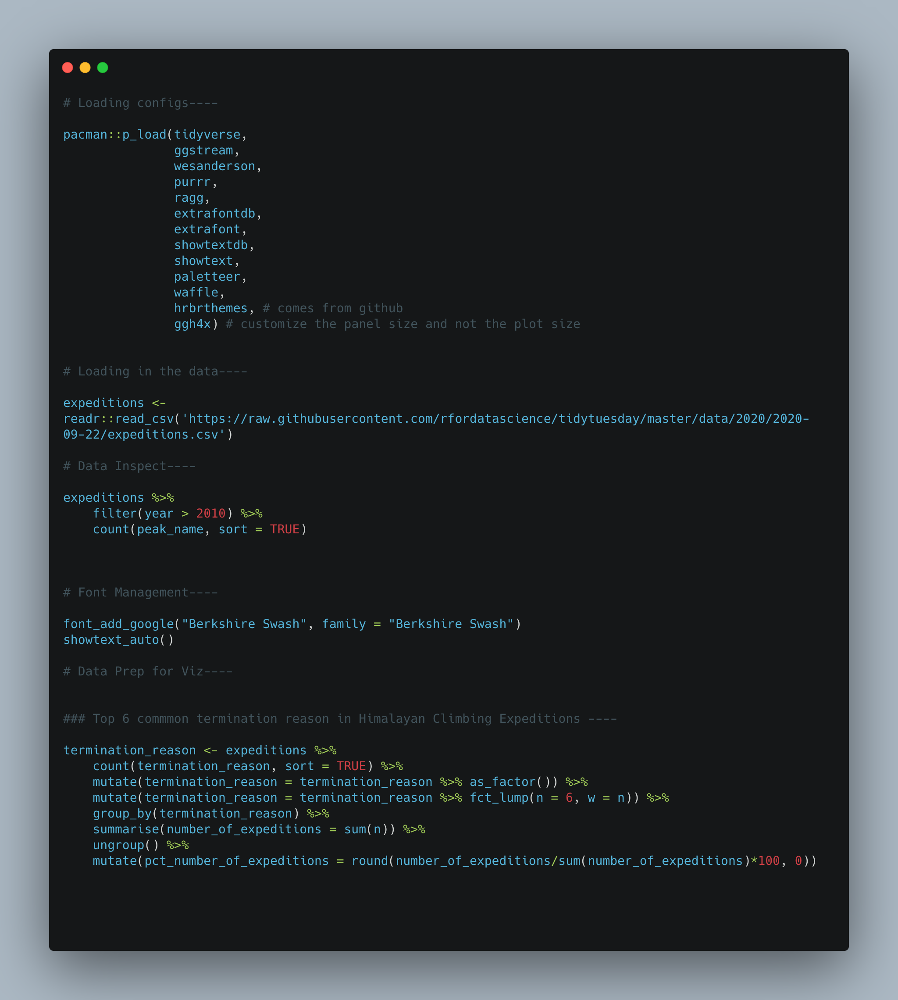
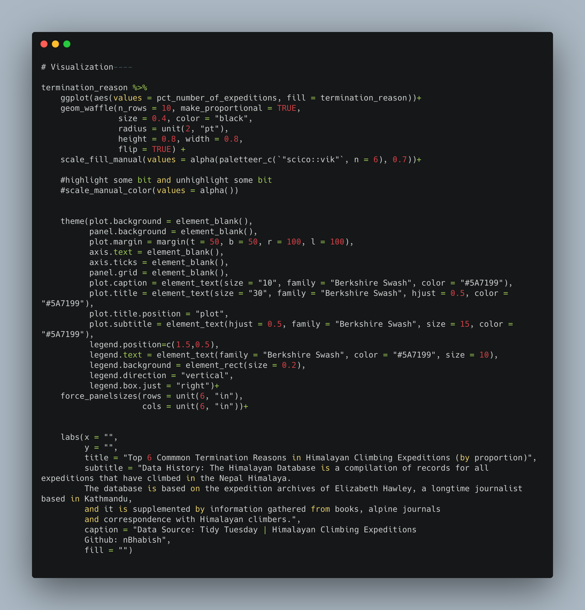

```{r loading-libraries, message=FALSE, warning=FALSE, include=FALSE}
pacman::p_load(tidyverse,
               ggstream,
               wesanderson,
               purrr,
               ragg,
               extrafontdb,
               extrafont,
               showtextdb,
               showtext, 
               paletteer, 
               waffle,
               hrbrthemes, # comes from github
               ggh4x) # customize the panel size and not the plot size
```

```{r data-prep, message=FALSE, warning=FALSE, include=FALSE}
# Loading in the data----

expeditions <- readr::read_csv('https://raw.githubusercontent.com/rfordatascience/tidytuesday/master/data/2020/2020-09-22/expeditions.csv')

# Data Inspect----

expeditions %>% 
    filter(year > 2010) %>% 
    count(peak_name, sort = TRUE)

# Font Management----

font_add_google("Berkshire Swash", family = "Berkshire Swash")
showtext_auto()

# Data Prep for Viz----


### Top 5 commmon termination reason in Himalayan Climbing Expeditions ----

termination_reason <- expeditions %>% 
    count(termination_reason, sort = TRUE) %>% 
    mutate(termination_reason = termination_reason %>% as_factor()) %>% 
    mutate(termination_reason = termination_reason %>% fct_lump(n = 6, w = n)) %>% 
    group_by(termination_reason) %>% 
    summarise(number_of_expeditions = sum(n)) %>% 
    ungroup() %>% 
    mutate(pct_number_of_expeditions = round(number_of_expeditions/sum(number_of_expeditions)*100, 0))


```

# Visualization

```{r plotting, echo=FALSE, fig.height=14, fig.width=22, message=FALSE, warning=FALSE}
termination_reason %>% 
    ggplot(aes(values = pct_number_of_expeditions, fill = termination_reason))+
    geom_waffle(n_rows = 10, make_proportional = TRUE, 
                size = 0.4, color = "black",
                radius = unit(2, "pt"),
                height = 0.8, width = 0.8,
                flip = TRUE) +
    scale_fill_manual(values = alpha(paletteer_c(`"scico::vik"`, n = 6), 0.7))+
    
    #highlight some bit and unhighlight some bit
    #scale_manual_color(values = alpha())
    
    
    theme(plot.background = element_blank(),
          panel.background = element_blank(),
          plot.margin = margin(t = 50, b = 50, r = 100, l = 100),
          axis.text = element_blank(),
          axis.ticks = element_blank(),
          panel.grid = element_blank(),
          plot.caption = element_text(size = "20", family = "Berkshire Swash", color = "#5A7199"),
          plot.title = element_text(size = "40", family = "Berkshire Swash", hjust = 0.5, color = "#5A7199"),
          plot.title.position = "plot",
          plot.subtitle = element_text(hjust = 0.5, family = "Berkshire Swash", size = 25, color = "#5A7199"),
          legend.position=c(1.4,0.5),
          legend.text = element_text(family = "Berkshire Swash", color = "#5A7199", size = 15),
          legend.direction = "vertical",
          legend.box.just = "right")+
    force_panelsizes(rows = unit(8, "in"),
                     cols = unit(8, "in"))+
    
    
    labs(x = "",
         y = "",
         title = "Top 6 Commmon Termination Reasons in Himalayan Climbing Expeditions (by proportion)",
         subtitle = "Data History: The Himalayan Database is a compilation of records for all expeditions that have climbed in the Nepal Himalaya. 
         The database is based on the expedition archives of Elizabeth Hawley, a longtime journalist based in Kathmandu,
         and it is supplemented by information gathered from books, alpine journals 
         and correspondence with Himalayan climbers.",
         caption = "Data Source: Tidy Tuesday | Himalayan Climbing Expeditions
         Github: nBhabish",
         fill = "") 
```


# Code Chunks



 
